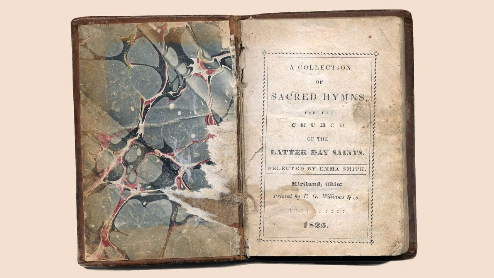
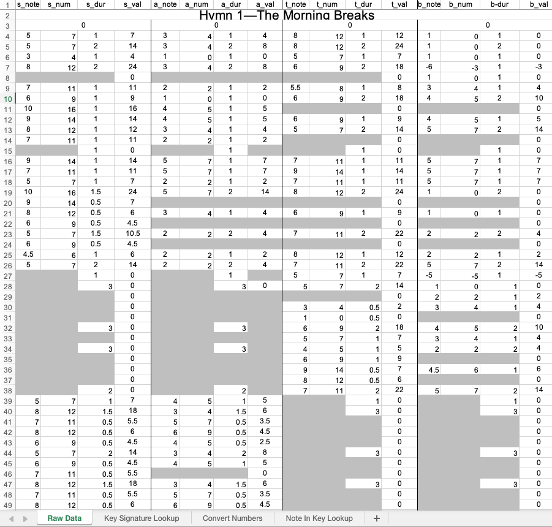
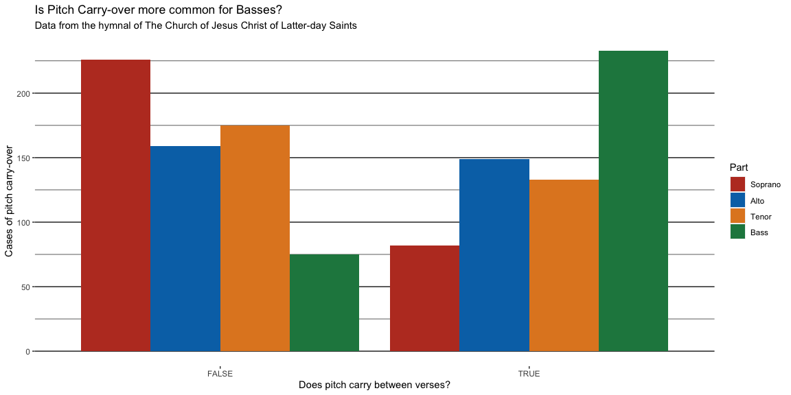

Do Basses Carry-over?
================
Daniel Bagley

Members of the Church of Jesus Christ of Latter-day Saints sing from a
selection of songs, known as hymns, in their worship services. These
hymns are collected in a hymnal published by the Church since 1835 with
periodic revisions (including a new, internationalized version currently
in development as of 2022). While the early hymnbooks contained only a
selection of texts which were then sung according to whatever tune the
singers chose, modern hymnbooks are broken into 4-part piano scores and
arranged by topic, with a thorough index of topics, titles, and authors
in the back.

There is a strong tradition of choral singing in The Church of Jesus
Christ of Latter-day Saints, ranging from the semi-professional
Tabernacle Choir on Temple Square to the ward choirs that the Church’s
[General
handbook](https://www.churchofjesuschrist.org/study/manual/general-handbook/19-music?lang=eng#title_number51)
encourages. Indeed, that same handbook states that “Choirs are
encouraged to use the hymns of the Church” as found in the hymnbook.
Therefore, those Church members who can read music are well-accustomed
to singing from these 4 part arrangements, whose individual voices are
traditionally called Soprano, Alto, Tenor, and Bass (the common nickname
for this arrangement is therefore SATB). In other words, in the
SATB-arranged hymnbook the choir sings one of the four notes played by
the piano/organ.

### The Bass part is boring?

Some have claimed that the Bass part, the lowest notes in the song, is
more “boring” or “same-y” than the other parts. While this is not the
place for a discussion of musical theory, it is noteworthy to state that
the Soprano part sings the melody, or guiding tune of the song, while
the Alto, Tenor, and Bass parts provide harmony or accompaniment.
Therefore, it seems reasonable to conclude that Sopranos, most of the
time, have the more interesting part; barring those rarer cases when the
melody is carried by a different part.

The particular question of whether or not the Bass part is the most
boring is difficult to quantify, however one method could be to examine
how often, in each song, the Bass part changes pitch. This analysis will
focus on one small aspect of that pitch variability, leaving analysis of
the total variance during the hymn to another investigation.

While pondering upon the potential boring-ness of the Bass part, the
researcher discovered an apparent trend within the hymnbook. It seemed
as though many hymns had Bass parts which began and ended on the same
note precisely, while the Soprano, Alto, and Tenor parts did not. This
would mean that between the separate verses of the hymns, the Bass part
would stay on the same note; they could essentially hold that note over
to the next verse of the song. We will henceforth refer to this
characteristic as **pitch carry-over.**

Being a carry-over hymn would, surely, be an indication of
“boring”-ness. Therefore, the present research will limit itself
strictly to the investigation of this proposition; namely that *those
singing the Bass part in the hymnbook of The Church of Jesus Christ of
Latter-day Saints have a statistically higher likelihood to experience
pitch carry-over.*

To investigate this proposition, we will utilize a Chi-squared Test of
Independence and express our Null/Alternative Hypotheses thusly:

$$
  H_0: \text{Incidence of Pitch Carry-over and Part are Independent} \\
  H_a: \text{Incidence of Pitch Carry-over and Part are Associated}
$$

We will analyze our findings with $\alpha = .05$

## 

### Data and Wrangling

The story of this data is somewhat complex and involves a months-long
journey spanning several colleges. However, suffice to say that without
the incredible work of Brother Joey Stanley in the BYU Department of
Linguistics and his [LDS Hymn Selection](http://hymnstats.blogspot.com/)
site, this analysis could not have happened. The data itself was sent in
a personal email from Brother Stanley, and is therefore read in by the
local machine. From there, it gets a little messy. Because of the way
the data was originally organized, it had to be manipulated in complex
ways to produce a so-called “tidy” dataset. From an original format with
all the hymns separated by a blank line and their title, parts in
separate columns and every note a separate row, the dataframe was
manipulated to have 1 column each for hymn, title, part, first note,
last note, the difference between the notes, and whether or not that
difference is zero. It is this variable, the logical true/false of same
ending/starting note, that will be utilized for the analysis. Below code
demonstrates the wrangling and shows an example of what all 22,435 rows
of the file looked like:

### Overview of the Data

With cleaned and wrangled data, we are left with a smaller dataset than
previously. This is because not all the songs in The Church of Jesus
Christ of Latter-day Saints’ hymnbook are arranged in four parts. We
will exclude those songs, leaving us with a sample of 308 separate
hymns. Let us examine a plot of the data:

There is an almost symmetrical relationship between Bass and Soprano in
this plot, with far more cases of pitch carry-over for Bass than any
other part. This is further reinforced by a table of the counts per
part:

|           | Soprano | Alto | Tenor | Bass |
|:---------:|:-------:|:----:|:-----:|:----:|
| **FALSE** |   226   | 159  |  175  |  75  |
| **TRUE**  |   82    | 149  |  133  | 233  |

Interestingly, the Alto and Tenor parts both have roughly equal numbers
of carry-over vs. non-carry-over hymns. The Soprano part appears the
most variable, and Basses the least so. Although we see what seem to be
clear patterns, we can not determine if they are statistically
significant until we analyze the data using a hypothesis test.

## Analysis

Because this question is categorical in nature, we can address it using
a Chi-squared test of independence. This statistical test will determine
if there is evidence that the counts of pitch carry-over depend upon the
vocal part. Before assessing the results of the test, we will examine a
table of expected values to determine whether Chi-squared testing is
appropriate for this data. If the test is appropriate, we will see a
value of 5 for each expected coung, or a mean of at least five with no
count less than 1.

|           | Soprano | Alto  | Tenor | Bass  |
|:---------:|:-------:|:-----:|:-----:|:-----:|
| **FALSE** |  158.8  | 158.8 | 158.8 | 158.8 |
| **TRUE**  |  149.2  | 149.2 | 149.2 | 149.2 |

Table of Expected Values

As seen in the table of expected values, all counts are at least 5, so
it is appropriate to perform a Chi-squared test upon our data. Doing so,
we find the following:

| Test statistic | df  |      P value       |
|:--------------:|:---:|:------------------:|
|     153.4      |  3  | 4.861e-33 \* \* \* |

Results of Chi-squared Test

With a Test statistic of 153.4 and 3 degrees of freedom, we find a
p-value of 4.861e-33. In standard notation, this is $4.861$ with 33
zeros in front of it, a remarkably small number well below
$\alpha = .05$. Therefore, we have significant evidence to conclude that
the vocal part you sing is associated with the incidence of pitch
carry-over in the hymnbook of The Church of Jesus Christ of Latter-day
Saints. To further investigate which parts specifically affect this
association, we will examine a table of Pearson’s Residuals. In
examining this table, we are looking for which values are the farthest
away from 0, as that will indicate they are contributing to the low
p-value.

|           | Soprano |   Alto   | Tenor |  Bass  |
|:---------:|:-------:|:--------:|:-----:|:------:|
| **FALSE** |  5.337  | 0.01984  | 1.29  | -6.647 |
| **TRUE**  | -5.505  | -0.02046 | -1.33 | 6.855  |

Table of Pearson’s Residuals

As seen in the table of residuals, the Bass and Soprano parts have
residual values far from zero, with far more counts of pitch carry-over
for the Bass part and far less for the Soprano part than if they were
independent. Therefore, we may conclude that those who sing Bass will
indeed experience statistically significantly greater incidence of pitch
carry-over when singing from the hymnbook of The Church of Jesus Christ
of Latter-day Saints.

## Conclusion

Having found a significant result, it is important to consider why that
might be. In every hymn, the melody, rhythm, harmony, and dynamics work
together to produce the sound. While everyone likes to sing the lead
part, the song simply wouldn’t sound good if they did. Furthermore, we
must remember that the vocal parts and the piano parts are, in this
hymnbook, the same. It is unreasonable to expect that a congregation’s
pianist (they are not professional players but volunteers) will play 4
complex parts at once, rather the bottom two parts most often exist to
provide a solid harmony to the far more interesting melody. So while we
have found a significant result, it is unlikely that there is much
real-world application for this result. However, it would be very
interesting to reexamine this dataset with an eye not towards the pitch
carry-over but towards total pitch variability in each song, to see
which hymns are the **most** boring for those blessed to sing Bass.
