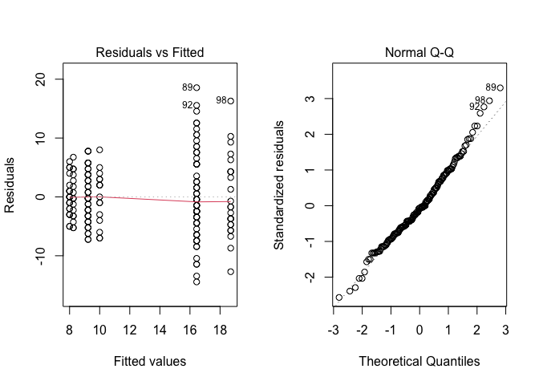
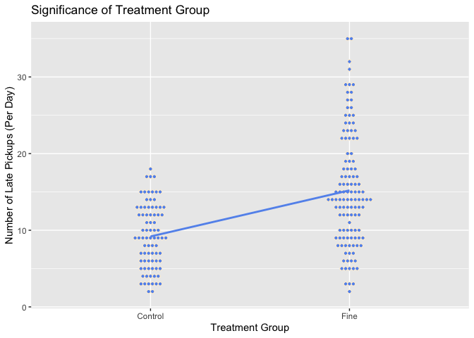
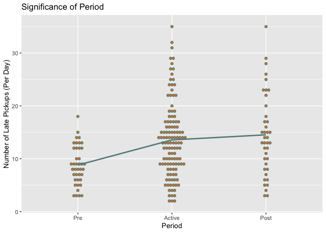
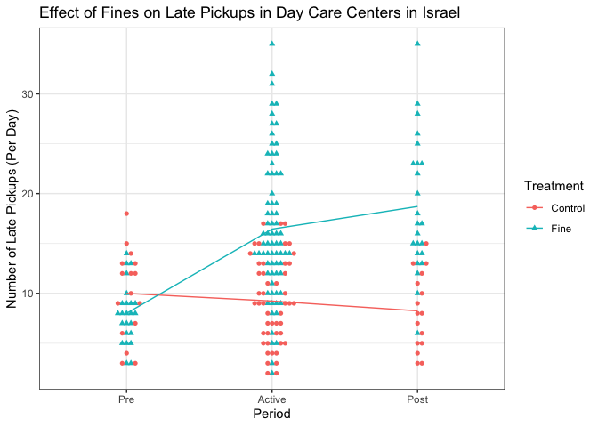

```r
library(mosaic)
library(DT)
library(pander)
library(car)
library(tidyverse)
library(ggbeeswarm)


## Wide data from original article:
late <- read.csv("data/daycare.csv", header=TRUE) 

## Change to "long" data for use in R:
Late <- pivot_longer(late, #Start with wide data set late
               cols = starts_with("Week"), #Find columns to gather from long data
               names_to = "Week", #New column name of Weeks in long data
               names_prefix = "Week", #Remove prefix of Week from Week1, Week2, ...
               names_transform = list(Week= ~as.numeric(.x)), #Make Week a numeric column of data
               values_to = "NumberofLateChildren") #Name of data column in long data
```

## Background {.tabset .tabset-fade}

### Overview
In an effort to reduce lateness upon pickup among parents at day care centers in Israel, a study was performed to determine if adding a small fine for late pickup would cause parents to be on time more often. This study was performed over 20 weeks in 10 similar centers which have negligible differences between themselves. This analysis will use the following hypotheses:

$$
  Y_{ijk} = \mu + \alpha_i + \beta_j + \alpha\beta_{ij} + \epsilon_{ijk}
$$
where $\mu$ is the grand mean, $\alpha_i$ is the treatment group factor with levels $Ctrl = 1$ and $Fine = 2$, $\beta_j$ is the treatment application factor with levels $Pre = 1$, $Active = 2$, and $Post = 3$, $\alpha\beta_{ij}$ is the interaction of the two factors which has $2 \times 3 = 6$ levels, and $\epsilon_{ijk}$ is the normally distributed error term.

This equation allows us to ask the following questions and hypotheses:

1: Does the treatment group affect the average number of late pickups?
Factor: treatment with levels $Ctrl$ and $Fine$.
$$
  H_0 : \alpha_{Ctrl} = \alpha_{Fine} = 0
$$
$$
  H_A : \alpha_i \neq 0 \  \text{for at least one}\ i\in\{1=Ctrl,2=Fine\}
$$

2: Does Treatment period affect the average number of late pickups?
Factor: Treatment period with levels $Pre$,$Active$, and $Post$

$$
  H_0 : \beta_{\text{Pre}} = \beta_{Active} = \beta_{Post} = 0
$$
$$
  H_A : \beta_j \neq 0 \ \text{for at least one} \ j \in\{1 = Pre, 2 = Active, 3 = Post\} 
$$

3: Does the effect of Treatment Period change for different groups of Treatment Group? In other words, is there an interaction between Treatment group and period?
$$
  H_0 : \alpha\beta_{ij} = 0 \ \text{for all} \ i,j = 0
$$
$$
  H_a : \alpha\beta_{ij} \neq 0 \ \text{for at least one} \ i,j
$$
A level of significance of $\alpha = 0.05$ will be used for this study.


<!--End your background before here.-->
<!--Click the little black arrow to 
the left to expand/hide these next sections.-->
### Study Details

<div style="color:#a8a8a8;">
This background is quoted directly from the article ["A Fine is a Price"](http://rady.ucsd.edu/faculty/directory/gneezy/pub/docs/fine.pdf). 
</div>

<div style="padding-left:30px; padding-right:30px;">

There are two types of day-care centers in Israel: private and public. A study was conducted in 10 private day-care centers in the city of Haifa from January to June 1998. All of these centers are located in the same part of town, and there is no important difference among them. During the day children are organized into groups according to age, from 1 to 4 years old. Each day-care center is allowed to hold a maximum of 35 children. In some exceptional cases a few additional children are allowed. The fee for each child is NIS 1,400 per month. (The NIS is the New Israeli Shekel.) At the time of the study, a U.S. dollar was worth approximately NIS 3.68, so the fee was about $380 at that time. 

The contract signed at the beginning of the year states that the day-care
center operates between 0730 and 1600. There is no mention of what happens if parents come late to pick up their children. In particular, before the beginning of the study, there was no fine for coming late. When parents did not come on time, one of the teachers had to wait with the children concerned. Teachers would rotate in this task, which is considered part of the job of a teacher, a fact that is clearly explained when a teacher is hired. Parents rarely came after 1630. 

A natural option [to fix the problem of parents showing up late] is to introduce a fine: every time a parent comes late, [they] will have to pay a fine. Will that reduce the number of parents who come late? If the fine is removed, will things revert back to the way they were originally?

The overall period of the study was 20 weeks. In the first 4 weeks we
simply recorded the number of parents who arrived late each week. At the
beginning of the fifth week, we introduced a fine in six of the 10 day-care centers, which had been selected randomly. The announcement of the fine was made with a note posted on the bulletin board of the day-care center. Parents tend to look at this board every day, since important announcements are posted there. The announcement specified that the fine would be NIS 10 for a delay of 10 minutes or more. The fine was per child; thus, if parents had two children in the center and they came late, they had to pay NIS 20. Payment was made to the principal of the day-care center at the end of the month. Since monthly payments are made to the owner during the year, the fines were added to those amounts. The money was paid to the owner, rather then to the teacher who was staying late (and did not get any additional money). The teachers were informed of the fine but not of the study. Registering the names of parents who came late was a common practice in any case.

At the beginning of the seventeenth week, the fine was removed with no explanation. Notice of the cancellation was posted on the board. If parents asked why the fines were removed, the principals were instructed to reply that the fine had been a trial for a limited time and that the results of this trial were now being evaluated.

A comparison with other fines in Israel may give an idea of the size of
the penalty that was introduced. A fine of NIS 10 is relatively small but not insignificant. In comparison, the fine for illegal parking is NIS 75; the fine for driving through a red light is NIS 1,000 plus penalties; the fine for not collecting the droppings of a dog is NIS 360. For many of these violations, however, detection and enforcement are low or, as in the case of dog dirt, nonexistent in practice. A baby-sitter earns between NIS 15 and NIS 20 per hour. The average gross salary per month in Israel at the time of the study was NIS 5,595.

</div>


### The Data (Wide)


The `late` Day Care Center data is shown here in the "wide data format". 


```r
#Show the full width of the "Wide" version of the late data:
pander(late, split.tables = Inf)
```


---------------------------------------------------------------------------------------------------------------------------------------------------------------------------------------------------------------
 Treatment   Center   No.ofChildren   Week1   Week2   Week3   Week4   Week5   Week6   Week7   Week8   Week9   Week10   Week11   Week12   Week13   Week14   Week15   Week16   Week17   Week18   Week19   Week20 
----------- -------- --------------- ------- ------- ------- ------- ------- ------- ------- ------- ------- -------- -------- -------- -------- -------- -------- -------- -------- -------- -------- --------
   Fine        1           37           8       8       7       6       8       9       9      12      13       13       15       13       14       16       14       15       16       13       15       17   

   Fine        2           35           6       7       3       5       2      11      14       9      16       12       10       14       14       16       12       17       14       10       14       15   

   Fine        3           35           8       9       8       9       3       5      15      18      16       14       20       18       25       22       27       19       20       23       23       22   

   Fine        4           34          10       3      14       9       6      24       8      22      22       19       25       18       23       22       24       17       15       23       25       18   

   Fine        5           33          13      12       9      13      15      10      27      28      35       10       24       32       29       29       26       31       26       35       29       28   

   Fine        6           28           5       8       7       5       5       9      12      14      19       17       14       13       10       15       14       16       6        12       17       13   

  Control      7           35           7      10      12       6       4      13       7       8       5       12       3        5        6        13       7        4        7        10       4        6    

  Control      8           34          12       9      14      18      10      11       6      15      14       13       7        12       9        9        17       8        5        11       8        13   

  Control      9           34           3       4       9       3       3       5       9       5       2       7        6        6        9        4        9        2        3        8        3        5    

  Control      10          32          15      13      13      12      10       9      15      15      15       10       17       12       13       11       14       17       12       9        15       13   
---------------------------------------------------------------------------------------------------------------------------------------------------------------------------------------------------------------


### The Data (Long)

The `Late` Day Care Center data is shown here in the "long data format".


```r
pander(Late)
```


------------------------------------------------------------------
 Treatment   Center   No.ofChildren   Week   NumberofLateChildren 
----------- -------- --------------- ------ ----------------------
   Fine        1           37          1              8           

   Fine        1           37          2              8           

   Fine        1           37          3              7           

   Fine        1           37          4              6           

   Fine        1           37          5              8           

   Fine        1           37          6              9           

   Fine        1           37          7              9           

   Fine        1           37          8              12          

   Fine        1           37          9              13          

   Fine        1           37          10             13          

   Fine        1           37          11             15          

   Fine        1           37          12             13          

   Fine        1           37          13             14          

   Fine        1           37          14             16          

   Fine        1           37          15             14          

   Fine        1           37          16             15          

   Fine        1           37          17             16          

   Fine        1           37          18             13          

   Fine        1           37          19             15          

   Fine        1           37          20             17          

   Fine        2           35          1              6           

   Fine        2           35          2              7           

   Fine        2           35          3              3           

   Fine        2           35          4              5           

   Fine        2           35          5              2           

   Fine        2           35          6              11          

   Fine        2           35          7              14          

   Fine        2           35          8              9           

   Fine        2           35          9              16          

   Fine        2           35          10             12          

   Fine        2           35          11             10          

   Fine        2           35          12             14          

   Fine        2           35          13             14          

   Fine        2           35          14             16          

   Fine        2           35          15             12          

   Fine        2           35          16             17          

   Fine        2           35          17             14          

   Fine        2           35          18             10          

   Fine        2           35          19             14          

   Fine        2           35          20             15          

   Fine        3           35          1              8           

   Fine        3           35          2              9           

   Fine        3           35          3              8           

   Fine        3           35          4              9           

   Fine        3           35          5              3           

   Fine        3           35          6              5           

   Fine        3           35          7              15          

   Fine        3           35          8              18          

   Fine        3           35          9              16          

   Fine        3           35          10             14          

   Fine        3           35          11             20          

   Fine        3           35          12             18          

   Fine        3           35          13             25          

   Fine        3           35          14             22          

   Fine        3           35          15             27          

   Fine        3           35          16             19          

   Fine        3           35          17             20          

   Fine        3           35          18             23          

   Fine        3           35          19             23          

   Fine        3           35          20             22          

   Fine        4           34          1              10          

   Fine        4           34          2              3           

   Fine        4           34          3              14          

   Fine        4           34          4              9           

   Fine        4           34          5              6           

   Fine        4           34          6              24          

   Fine        4           34          7              8           

   Fine        4           34          8              22          

   Fine        4           34          9              22          

   Fine        4           34          10             19          

   Fine        4           34          11             25          

   Fine        4           34          12             18          

   Fine        4           34          13             23          

   Fine        4           34          14             22          

   Fine        4           34          15             24          

   Fine        4           34          16             17          

   Fine        4           34          17             15          

   Fine        4           34          18             23          

   Fine        4           34          19             25          

   Fine        4           34          20             18          

   Fine        5           33          1              13          

   Fine        5           33          2              12          

   Fine        5           33          3              9           

   Fine        5           33          4              13          

   Fine        5           33          5              15          

   Fine        5           33          6              10          

   Fine        5           33          7              27          

   Fine        5           33          8              28          

   Fine        5           33          9              35          

   Fine        5           33          10             10          

   Fine        5           33          11             24          

   Fine        5           33          12             32          

   Fine        5           33          13             29          

   Fine        5           33          14             29          

   Fine        5           33          15             26          

   Fine        5           33          16             31          

   Fine        5           33          17             26          

   Fine        5           33          18             35          

   Fine        5           33          19             29          

   Fine        5           33          20             28          

   Fine        6           28          1              5           

   Fine        6           28          2              8           

   Fine        6           28          3              7           

   Fine        6           28          4              5           

   Fine        6           28          5              5           

   Fine        6           28          6              9           

   Fine        6           28          7              12          

   Fine        6           28          8              14          

   Fine        6           28          9              19          

   Fine        6           28          10             17          

   Fine        6           28          11             14          

   Fine        6           28          12             13          

   Fine        6           28          13             10          

   Fine        6           28          14             15          

   Fine        6           28          15             14          

   Fine        6           28          16             16          

   Fine        6           28          17             6           

   Fine        6           28          18             12          

   Fine        6           28          19             17          

   Fine        6           28          20             13          

  Control      7           35          1              7           

  Control      7           35          2              10          

  Control      7           35          3              12          

  Control      7           35          4              6           

  Control      7           35          5              4           

  Control      7           35          6              13          

  Control      7           35          7              7           

  Control      7           35          8              8           

  Control      7           35          9              5           

  Control      7           35          10             12          

  Control      7           35          11             3           

  Control      7           35          12             5           

  Control      7           35          13             6           

  Control      7           35          14             13          

  Control      7           35          15             7           

  Control      7           35          16             4           

  Control      7           35          17             7           

  Control      7           35          18             10          

  Control      7           35          19             4           

  Control      7           35          20             6           

  Control      8           34          1              12          

  Control      8           34          2              9           

  Control      8           34          3              14          

  Control      8           34          4              18          

  Control      8           34          5              10          

  Control      8           34          6              11          

  Control      8           34          7              6           

  Control      8           34          8              15          

  Control      8           34          9              14          

  Control      8           34          10             13          

  Control      8           34          11             7           

  Control      8           34          12             12          

  Control      8           34          13             9           

  Control      8           34          14             9           

  Control      8           34          15             17          

  Control      8           34          16             8           

  Control      8           34          17             5           

  Control      8           34          18             11          

  Control      8           34          19             8           

  Control      8           34          20             13          

  Control      9           34          1              3           

  Control      9           34          2              4           

  Control      9           34          3              9           

  Control      9           34          4              3           

  Control      9           34          5              3           

  Control      9           34          6              5           

  Control      9           34          7              9           

  Control      9           34          8              5           

  Control      9           34          9              2           

  Control      9           34          10             7           

  Control      9           34          11             6           

  Control      9           34          12             6           

  Control      9           34          13             9           

  Control      9           34          14             4           

  Control      9           34          15             9           

  Control      9           34          16             2           

  Control      9           34          17             3           

  Control      9           34          18             8           

  Control      9           34          19             3           

  Control      9           34          20             5           

  Control      10          32          1              15          

  Control      10          32          2              13          

  Control      10          32          3              13          

  Control      10          32          4              12          

  Control      10          32          5              10          

  Control      10          32          6              9           

  Control      10          32          7              15          

  Control      10          32          8              15          

  Control      10          32          9              15          

  Control      10          32          10             10          

  Control      10          32          11             17          

  Control      10          32          12             12          

  Control      10          32          13             13          

  Control      10          32          14             11          

  Control      10          32          15             14          

  Control      10          32          16             17          

  Control      10          32          17             12          

  Control      10          32          18             9           

  Control      10          32          19             15          

  Control      10          32          20             13          
------------------------------------------------------------------

 
##  
<!-- This is where the backend happens.-->


```r
Late <- Late %>% 
  mutate(Period = case_when(
    Week %in% c(1:4) ~ "Pre",
    Week %in% c(5:16) ~ "Active",
    Week %in% c(17:20) ~ "Post"
    ),
    
  Period = factor(Period, levels = c("Pre", "Active", "Post"))
  )

Late_Nova <- aov(NumberofLateChildren ~ Period*Treatment, data = Late)

period_means <- Late %>% 
  group_by(Period) %>%
  summarise(Period_means = mean(NumberofLateChildren))

treat_means <- Late %>% 
  group_by(Treatment) %>%
  summarise(Treat_means = mean(NumberofLateChildren))

combo_means <- Late %>% 
  group_by(Treatment, Period) %>%
  summarise(combo_means = mean(NumberofLateChildren))
```
## Analysis

### Diagnostic plots
the normality of the data may be compromised, as seen in this plot of normality of Error terms (Normal Q-Q), which shows some digression from the expected values near the top of the chart. Also of potential concern is the Residuals vs Fitted plot, which indicate that the last two groupings have significantly different variance than the first 4. Because of this, it is difficult to assume constancy of variance, and the requirements for an ANOVA test may be compromised. However, because the ANOVA is a robust test, we will proceed with the analysis and consider ways to further validate what results are indicated in the interpretation section.


```r
par(mfrow = c(1,2))
plot(Late_Nova, which = 1:2)
```

<!-- -->

Graphical representation of the data reveals the following in regards to each hypothesis test:

### Treatment Group
First, let us examine the difference between treatment groups. As the chart indicates, there is a visual difference in means between the Control and Fine groups. This difference will require further examination through a Two-Way ANOVA to see if the difference is statistically significant.


```r
#Creation of Graph for difference between Treatment groups
ggplot(Late, aes(x = factor(Treatment), y = NumberofLateChildren)) + 
  geom_dotplot(binaxis = "y", dotsize = .5, stackdir = "center", fill = "cornflowerblue", color = "papayawhip", binwidth = 1) + 
  geom_line(data = treat_means, aes(y = Treat_means),color = "cornflowerblue", size = 1, group = 1) +
  labs(x = "Treatment Group", 
       y = "Number of Late Pickups (Per Day)", 
       title = "Significance of Treatment Group")
```

<!-- -->

```r
Late %>% 
  group_by(Treatment) %>% 
  summarise("Mean Number of Late Pickups" = mean(NumberofLateChildren)) %>% 
  pander(caption = "Mean Number of Late Pickups according to Treatment Group")
```


-----------------------------------------
 Treatment   Mean Number of Late Pickups 
----------- -----------------------------
  Control               9.188            

   Fine                 15.21            
-----------------------------------------

Table: Mean Number of Late Pickups according to Treatment Group

### Treatment Period
Next, let us examine the difference between treatment periods. As the study details indicated, there are three major periods of treatment: A Baseline "Pre" period, an "Active" period where the fine was being charged, and a "Post" period where the fine was removed again. As can be seen, the Pre group has a much lower mean, but the Active and Post groups appear to be similar.


```r
#creation of plot for Period groups
ggplot(Late, aes(y = NumberofLateChildren, x = Period)) +
  geom_dotplot(binaxis = "y",
               stackdir = "center",
               dotsize = .5,
               color = "paleturquoise4",
               binwidth = 1,
               fill = "peru") +
 geom_line(data = period_means, aes(y = Period_means), 
           group = 1,
           size = 1, 
           color = "paleturquoise4") +
  labs(title = "Significance of Period",
       x = "Period",
       y = "Number of Late Pickups (Per Day)") 
```

<!-- -->


```r
Late %>% 
  group_by(Period) %>% 
  summarise("Mean Number of Late Pickups" = mean(NumberofLateChildren)) %>% 
  pander(caption = "Mean Number of Late Pickups according to Treatment Period")
```


--------------------------------------
 Period   Mean Number of Late Pickups 
-------- -----------------------------
  Pre                 8.8             

 Active              13.56            

  Post               14.53            
--------------------------------------

Table: Mean Number of Late Pickups according to Treatment Period

### Interaction Between Treatment Group and Period
Finally, let us consider the interaction between Treatment Group and Period. As can be seen, it appears that before the Active treatment period, Number of late pickups is essentially the same between treatment groups. However, when the Active period begins there is a dramatic upward shift for Late Pickups in the Fine group, which does not disappear even when the Active period ends and the fine is eliminated. This interaction is very interesting, as it indicates some kind of behavior trapping is occurring when the fine is introduced; even after it is removed the average late pickups do not go back down. 


```r
#xyplot(NumberofLateChildren ~ factor(reorder(Period, Week)), 
       #data = Late, groups = Treatment, 
       #type = c("p", "a"), auto.key=list(corner=c(1,1)),
      # main = "Effect of Fines on Late Pickups in Day Care Centers in Israel")


#Creation of graph for interaction between treatment periods and groups
ggplot(Late, aes(x = Period, y = NumberofLateChildren, fill = Treatment, shape = Treatment, color = Treatment)) +
  geom_beeswarm(aes(shape = Treatment)) +
  geom_line(data = combo_means, aes(y = combo_means, color = Treatment, group = Treatment)) +
  #scale_shape_manual(values = c(1, 2)) #This would control exactly which shapes
  theme_bw() +
  labs(title = "Effect of Fines on Late Pickups in Day Care Centers in Israel",
       x = "Period",
       y = "Number of Late Pickups (Per Day)")
```

<!-- -->


```r
dplyr.summarise.inform = FALSE
Late %>% 
  group_by(Treatment, Period) %>% 
  summarise("Mean Number of Late Pickups" = mean(NumberofLateChildren), .groups = "keep") %>% 
    spread(Period, "Mean Number of Late Pickups") %>% 
  pander(caption = "Mean Number of Late Pickups according to Treatment Group")
```


----------------------------------
 Treatment   Pre   Active   Post  
----------- ----- -------- -------
  Control    10    9.229    8.25  

   Fine       8    16.44    18.71 
----------------------------------

Table: Mean Number of Late Pickups according to Treatment Group

Obviously, there are visual indications in all these graphs that there are differences between the groups examined. However, it will be necessary to examine these differences via ANOVA test to determine if they are statistically significant. As the table below shows, for each grouping identified, the p values of the test are very low.


```r
pander(summary(Late_Nova), caption = "ANOVA for Late Pickups according to Treatment and Period")
```


---------------------------------------------------------------------
        &nbsp;          Df    Sum Sq   Mean Sq   F value    Pr(>F)   
---------------------- ----- -------- --------- --------- -----------
      **Period**         2     828       414      12.91    5.456e-06 

    **Treatment**        1     1740     1740      54.25    4.925e-12 

 **Period:Treatment**    2    847.7     423.9     13.22    4.162e-06 

    **Residuals**       194    6222     32.07      NA         NA     
---------------------------------------------------------------------

Table: ANOVA for Late Pickups according to Treatment and Period

## Interpretation
Because these p values are so low, we can conclude that there is strong evidence supporting our Alternate hypotheses. As mentioned, the QQ plot of error terms and the plot of Residuals show that this data may be skewed, but the extremity of the p values indicate that we can still be confident in rejecting the null hypothesis despite moderate violation of the test requirements. Therefore, with a Significance level of $.05$ and $P = 5.45e-6,\ P = 4.92e-12, \ \text{and} \ P = 4.16e-6$, we reject our Null hypotheses, as there is sufficient evidence to suggest that there are differences between treatment group, period, and the interaction between the two.  
It is very interesting to consider, however, that the fine had the opposite of the intended effect, showing a dramatic uptick in late pickups after its imposition. Perhaps this difference is due to a psychological lessening of guilt at picking up the child late when the parent knows the Day Care is getting paid for that time. This test result obviously indicates a need for further research, to determine not only what CAN be done to reduce late pickups but also WHY a fine doesn't work.
