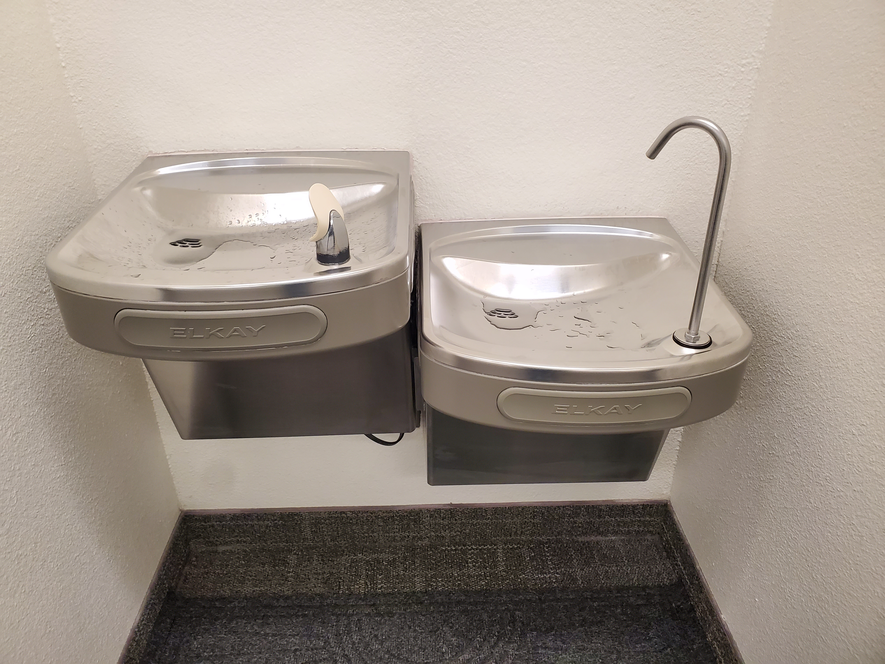
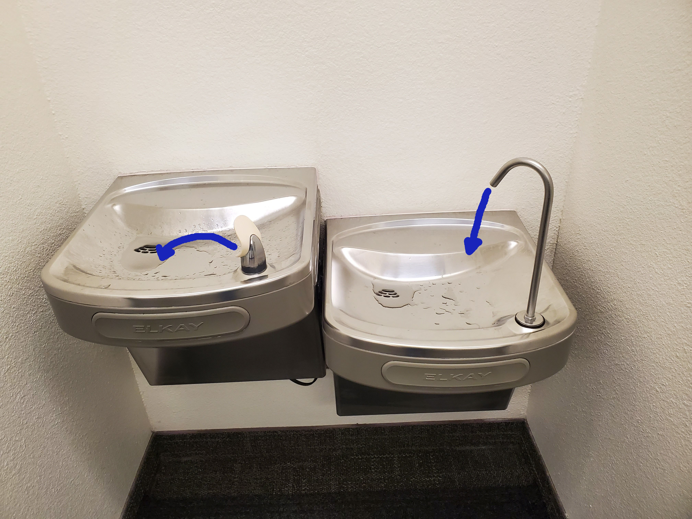
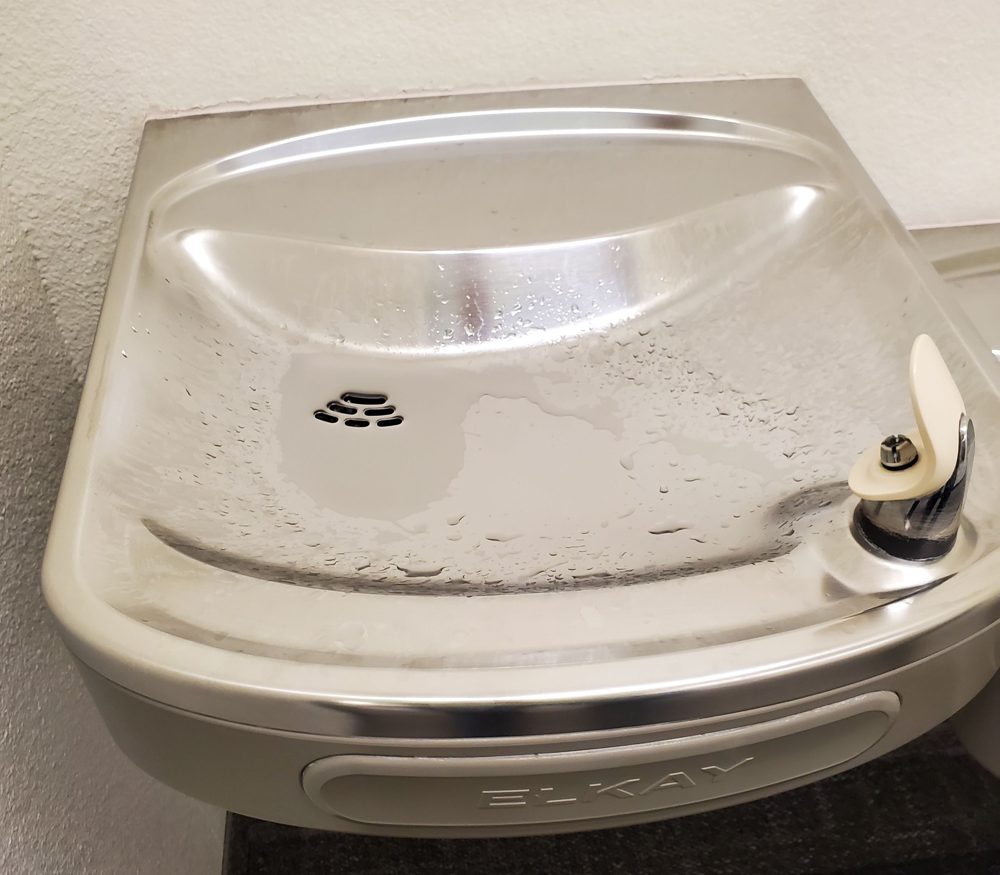

# {.tabset}
```{r read_wrangle, warning = FALSE, message=FALSE}
#load relevant packages
pacman::p_load(car, tidyverse, googlesheets4, gt, pander, mosaic, ggbeeswarm) 
#read data off of google sheets 
fountain <- read_sheet("1ezL77sIa6NroUrNnjeqidHkwFf9ZjmRck9NPqFw-ZPI") 
#factorize fountain type
fountain$Type <- as.factor(fountain$Type)
#set R syntax legal names for the dataset columns
names(fountain) <- c("Type", "Time", "Date")
fountain <- fountain |> mutate(group = if_else(Type == "Fountain", 1, 0))
# split data to simplify stats dataframe construction
filler <- filter(fountain, Type == "Filler")
fount  <- filter(fountain, Type == "Fountain")
# create relevant test models
fountain_test <- t.test(Time ~ Type, data = fountain)
fountain_nova <- aov(Time ~ Type + Date, data = fountain) 
diff_means <- abs(mean(fountain$Time[fountain$Type == "Fountain"]) - mean(fountain$Time[fountain$Type == "Filler"]))
```

## Background

The Mathematics Department at Brigham Young University-Idaho is housed in the second floor of the Thomas E. Ricks Building (referred to as the 'Ricks building' hereafter) of the university's campus in Rexburg, Idaho. Next to the department offices is a pair of drinking fountains. These are the fountains most accessible to students in mathematics courses, which are on the other side of the hall from the department offices. Of the pair, one fountain was converted to a bottle filler during the onset of the COVID-19 pandemic. The other fountain was disabled for a time, and has since been re-activated following loosening of quarantine/masking protocols. 

{width=50%}

As a mathematics student who has many courses in the Ricks building, I use this pair of drinking fountains 2-3 times a day to refill my water bottle, which holds about 24 oz. (approx. 750 ml). I have noticed that the diameter of the water stream that dispenses form the bottle filler seems to be smaller than that of the standard fountain next to it. This leads to the pertinent question of this work: is this bottle filler actually faster than simply holding your bottle up to the regular fountain's flow? To investigate this question, we will collect measurements of how long it takes to fill my water bottle with the standard fountain on the left and the bottle filler on the right, then perform a Student's t-test to determine whether any potential differences are statistically significant, or simply due to random chance.

### Hypotheses

We will formally state our hypotheses as follows, where $\mu_{\text{Fountain}}$ represents the mean time to fill the bottle using the regular water fountain and $\mu_{\text{Filler}}$ represents the mean time to fill the bottle using the bottle filler fountain.
$$
  H_0: \mu_{\text{Fountain}} = \mu_{\text{Filler}} \\
  H_a: \mu_{\text{Fountain}} \neq \mu_{\text{Filler}} \\
$$

We will set a Level of Significance $\alpha = 0.05$ for this analysis.

## Methods

#### Data collection 

The data were collected using a stopwatch and a 24 oz. (approx. 750 ml) water bottle, which was measured to determine its capacity. I held the bottle with one hand and used the stopwatch with the other so that each response could be measured by one individual. First, the lid was removed from the bottle, and the bottle was held near the spout of the water fountain. Then, the stopwatch was started at the same time I began applying constant pressure to the lever or switch of the fountain by leaning against it with my thigh. Since I am quite tall, those attempting to recreate this experiment might use their hip instead.

When recording measurements for the bottle filler, I simply held it under the stream of water until it reached the top of the bottle (where the threading of the lid begins), stopping the stopwatch immediately when it did so. For measurements using the regular fountain, it was necessary to hold the bottle at an angle that matched that of the fountain's stream. Therefore, when the water reached the top of the bottle and began overfilling, the bottle was not actually full due to its angle. In order to prevent any bias towards the fountain due to this fact, when the water reached the top of the bottle and began to overflow, I quickly righted the bottle and switched from the regular fountain to the filler, which I used to complete the filling of the bottle. 

{width=50%}

#### Justifying the tilt-and-switch
While most people probably wouldn't mind having their bottle being a few drops less full (about 1.5 ounces) due to the necessity of angling the bottle to use the regular fountain, I felt this adjustment using the filler was necessary to avoid concluding that the regular fountain's fill time was lower than in actual fact. Consider as well that the time (though very little) to switch between fountains adds to the fill time, so I believe that we have given the bottle filler attachment fountain every possible chance to display greater efficiency than the regular fountain.

Lastly, it is crucial to note that I recorded measurements only when no one else was using (or waiting for) the fountains; I was not sure if both fountains operating at once would make them run slower due to drawing from the same water supply. 

#### Date as a covariate
To avoid potential confounding due to taking measurements at different dates, I recorded the fill-time for each measurement and its date. I also randomized which fountain I used based on the date. Doing so will allow me to examine whether the date of data collection acts as a confounding variable for the fill time; we will use an ANCOVA to examine this in more detail later.

#### Sample size

Originally, I intended to collect 20 measurements of each fountain. However, an increase of time constraints necessitated taking only 6 measurements of each. Despite a small sample size, there is (spoiler alert) a much smaller spread between points than initially expected, so we will proceed with testing and carefully examine the testing requirements.


# {}

## Analysis

Having collected the responses, we can calculate some measures of central tendency and spread, then visualize the spread of our data and determine if testing requirements are met.


### Numerical summaries
It becomes immediately apparent that the two fountains have very different statistical parameters. Note that the mean fill time of the bottle filler fountain is `r round(mean(filler$Time),2)`, while the regular fountain has a much lower mean of `r round(mean(fount$Time),2)`. See below table for more measures of central tendency, the mode for both fountains is irrelevant due to having no repeated values.
```{r}
favstats(Time ~ Type, data = fountain)[c(-2,-6,-9,-10)] |> pander()
```

Note that the standard deviations of the two fountains are `r round(sd(filler$Time), 3)` and `r round(sd(fount$Time), 3)` respectively. There is clearly a very tight spread for both fountains, which bodes well for our testing as it indicates little variance inside groups. Examining the difference between groups, we will calculate some measures of spread: 


| Group | Range | Minimum | Maximum |  Mean | 
|:------|:-------:|:--------:|:----:|:----:|
| Filler   | `r max(filler$Time) - min(filler$Time)`| `r min(filler$Time)` | `r max(filler$Time)`  | `r round(mean(filler$Time),2)`  |
| Fountain | `r max(fount$Time) - min(fount$Time)`  | `r min(fount$Time) ` | `r max(fount$Time)`   | `r round(mean(filler$Time),2)`  |

These values clearly demonstrate that the two fountains have little "in common", so to say. With a vastly lower mean fill time, I expect to find that the regular fountain has a statistically significant difference from the bottle filler. Bare numbers can be deceiving, however, so let us examine a visual summary of the data for better understanding.

### Graphical summaries

As we examine this plot, note that our previous findings are supported visually. The Bottle Filler fountain lies much further to the right than the regular fountain, with a more tightly grouped distribution. Note the Mean value of each group is marked with a red vertical line.

```{r main_plot, message = FALSE, warning = FALSE}

ggplot(fountain, aes(x = Time, y = Type , fill = Type, color = Type)) + 
  geom_density_ridges(alpha = .8, linetype = 0) + 
  ggbeeswarm::geom_beeswarm(cex = 3, size = 2, side = 1L, shape = 21, color = "black") +
  geom_vline(xintercept = mean(fount$Time),  color = "indianred4", size = 1, alpha = .9) +
  geom_vline(xintercept = mean(filler$Time), color = "indianred4", size = 1, alpha = .9) +
  scale_fill_manual(values = c("deepskyblue", "dodgerblue1")) +
  labs(title = "How many seconds does it take to fill my bottle?",
       x = "Seconds to Fill the Bottle (less is better)",
       y = "Type of Water Fountain",
       subtitle = "Red vertical lines indicate group means") +
    theme(legend.position = "none",
        panel.background = element_rect(color = "black")
        )
```

The large empty zone between the two distributions of fill time demonstrates the noticeable difference when filling the water bottle between the two fountains. See also that the bottle filler fountain has a slightly tighter grouping. This may be because measurements of the regular fountain involved more human interaction (and therefore chance for error/variance) than the bottle filler. However, the difference between groups is so much larger than the difference inside groups that the variance of distributions is probably negligible. We will determine whether that is the case as we examine the testing requirements below.

### Testing Requirements

Because the sample size is small (6 each), we will utilize a QQ plot to assess the normality of the distribution of our data. As seen below, QQ plots of our two fountains' distributions both fall well within the confidence interval of normality and follow a straight enough line that we feel confident in saying that the populations of potential fill time using each fountain are normally distributed.

```{r test_reqs, out.width="50%"}
qqPlot(Time ~ Type, data = fountain)
```

We further assume that the samples collected are representative of the actual fountains' behaviors, and that there was no bias in collection (as discussed in the Methods section). Therefore, with both testing requirements for the Student's t-Test met, we will proceed with testing.

## Statistical testing

Before we examine the results of a t-Test using this data, let us briefly consider the possible confounding nature of the date each datum was collected. Because they were collected at different times and dates, the date of each measurement could affect the fill time. We plot the data according to date below to look for possible visual trends.

### Possible confouding by date

In this plot, it is expected that if there is no difference based on date there will be no discernable pattern of increase or decrease along the x-axis, Date of measurement. See the dotted lines for projections of such pattern:

```{r ancova_plot}

ggplot(fountain, aes(y = Time, x = Date, color = Type, shape = Type)) + 
  geom_point(size = 3) +
  geom_smooth(formula = "y ~ x", method = "lm", se = FALSE, linetype = "dotted") +
  scale_color_manual(values = c("deepskyblue", "dodgerblue1")) +
  labs(title = "Is there a date-based effect upon fill time?",
       x = "Date",
       y = "Time in seconds to fill the bottle")

```

As the lines are relatively flat along the horizontal (x-axis), we have little to no visual evidence that the date of measurement affects fill time. We can support this visual evidence with an ANCOVA model, using Date as a covariate. In this case, if the date has no effect upon the fill time, we should see a non-significant p-value. 

```{r ancova_results}
pander(summary(fountain_nova))
```

As we see, the p-value of our covariate is 0.984, well above our level of significance. Because of this, we can be assured that date is not a confounding variable and remove it from our model. Because of this, we can perform a student's t-test to determine whether or not the bottle filler is actually faster than the regular fountain.

### Test results

In the results below, see that the test statistic is `r round(fountain_test$statistic,2)`, which is quite high with our degrees of freedom. If there is statistically significant evidence that the two fountains have different actual fill times, we will see a p-value less than $0.05$. 

```{r test_results}
options(scipen = 100)
pander(fountain_test, caption = "Student's t-test of fountain data")
```

With a p-value of ` 0.0000000003789` and $\alpha = 0.05$, we reject the null hypothesis. We are confident that our group means of `r mean(fountain$Time[fountain$Type == "Fountain"])` and `r mean(fountain$Time[fountain$Type == "Filler"])` respectively are due to an actual difference in the length of time it takes to fill your water bottle using the regular fountain instead of the bottle filler. The difference is `r abs(round(mean(fountain$Time[fountain$Type == "Fountain"]) - mean(fountain$Time[fountain$Type == "Filler"]), 2))` seconds, demonstrating that contrary to our assumptions at the beginning of the test that the filler is either the same speed or faster, it actually takes far more time to fill my water bottle with the bottle filler fountain.

## Conclusion

{width=60%}

While it is not accurate to say that this analysis added very much to the human experience, it is possible to conclude that it improved *my* experience. If I fill my water bottle say, 3 times a day, I will save 3 * `r round(diff_means, 2)` = `r round(diff_means * 3, 2)` seconds every day, `r round(diff_means * 3 * 7, 2)` seconds a week, and `r round(diff_means * 21 * 52, 2)` seconds a year, which is approximately `r round((1092/3600) * diff_means)` hours. Writing and formattng this analysis took about 5 hours, so I think it's safe to say that that is a not-insignificant difference. In the future, perhaps the Ricks Building Facilities management can take into consideration that every time someone uses the fountain on the right of the second floor Ricks Building, they are losing 20 seconds off their life and consider removing the filler attachment or replacing the fountain altogether.

### Was there a point to any of this?
All humor aside, this analysis exists mostly because **I** wanted to know the answer. While this analysis also gave me practice with .Rmd formatting, visualization, and experimental design, not to mention using new R packages and improving my technical/persuasive writing, none of it would exist if I was not passionate enough about the topic to design, perform and analyze an experiment about it.

There are many topics we might focus upon in statistical research, and this is certainly not an "important" one, nor even one that applies to most people. But why should the perceived social value of a question determine its worthiness? It may be a case of cultural presentism to limit ourselves to learning only what the "state of the discipline" or the current culture determines worthwhile. In a few decades, the paradigm will shift and the so-called important problems of today will be forgotten. 

In that context, the only intellectually choice is to research what interests you, question what you have questions about, and experiment only on those topics that keep you up at night. Anything else is dishonesty.

*-Daniel*


