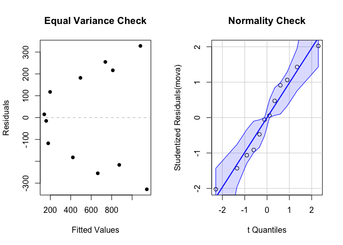
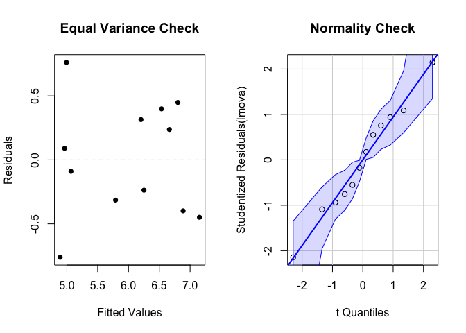
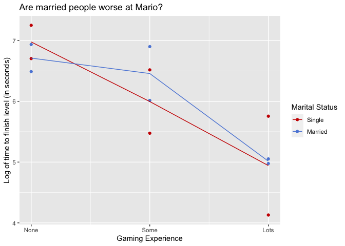

Does getting married make you bad at Mario?
================

## Introduction

Ever since the invention of video games, opinions have been split about
their value and appropriate use. While some enjoy video games a lot and
play them frequently, others eschew the practice entirely. In the
Intermountain West and especially at BYU-I, it has been observed by the
authors that the majority of those gaming enthusiasts are single. This
raises a question: are gamers single because that makes you a better
gamer, or are they single because it makes them less dateable? Answering
the second question is outside the scope of this study, but the first
can potentially be answered through it’s reverse, using an archetypal
game which has existed almost as long as video games themselves. In
other words; *does getting married make you bad at Mario?* We will
analyze this question using a convenience sample of those in the Rexburg
community who self-identified as gamers or otherwise. To provide an
accurate measurement, we will compare the time it takes to complete a
Mario Maker 2 map between single and married individuals, controlling
for other factors as discussed in the Methods section and performing an
Analysis of Covariance, or ANCOVA, of the results. This procedure infers
the following hypotheses:

#### Hypotheses

First Hypothesis: Marital status affects gaming skill

$$
  H_0: \alpha_M = \alpha_S = 0 \\
  H_a: \alpha_i \ne 0 \text{ for at least one } i \in \{M = \text{Married}, S = \text{Single}\}
$$

Second Hypothesis: Experience level affects gaming skill

$$
 H_0: \alpha_N = \alpha_S = \alpha_L = 0 \\
  H_a: \alpha_i \ne 0 \text{ for at least one } i \in \{N = \text{No experience}, S = \text{Some experience}, L = \text{Lots of Experience}\}
$$

Third Hypothesis: There is an interaction between Marital Status and
Gaming Experience

$$
  H_0: \text{The effect of Marital Status is the same for all levels of Experience} \\
  H_a: \text{The effect of Marital Status is not the same for all levels of Experience}
$$

We will use this model to analyze these hypotheses:

$$
 Y_{ijk} = \mu + \alpha_i + \beta_j + \alpha\beta_{ij} + \tau_k + \epsilon_{ijk}
$$

where $Y_{ijk}$ is the time to complete the map, $\mu$ is the benchmark
or grand average of all times, $\alpha_i$ is the effect of the
experience level of the participant, $\beta_j$ is the effect of the
marital status of the participant, $\alpha\beta_{ij}$ is the effect of
the interaction between the two factors, $\tau_k$ is the effect of our
covariate measure, and $\epsilon_{ijk}$ is the residual error.

Level of significance for this analysis is set at $\alpha = .05$.

## Methods

In order to collect quantitative data analyzing Mario skill, we selected
to measure the elapsed time between beginning a level and completing it.
Those who finish faster demonstrate more skill, while those who die
frequently or are less capable at navigating the obstacles of a Mario
level will take longer to do so.

To provide accessibility, Mario Maker 2 on the Nintendo Switch was
selected as a representative Mario game which is also portable. Research
participants played in the Handheld mode using standard Joy-Cons. The
particpants were convenience sampled according to those willing and
availiable to participate in the research, and sorted into 3 groups with
two members each:

-   Those who never or only very rarely play video games
-   Those who play some but not many video games
-   Those who are experienced gamers and play frequently

In each group there was a single and a married participant. This allows
us to treat both Marital Status and Gaming Experience as crossed, fixed
factors with 2 and 3 levels respectively.

To ensure that this experiment would represent all potential Mario Maker
experiences (and therefore all video game experiences), the map selected
to play upon was treated as a random variable with 6 levels. Each
experience level was assigned two maps, then the players in that
experience group played both maps and recorded their times. This means
that from a sample of 6 students, we received 12 data points. Because
the sample size is small, we will assume interaction between the
covariate and our other factors is negligible, thus allowing us the
degrees of freedom to perform an inferential test.

It was originally intended to use the selected map as a blocking
variable, but further design consideration revealed that it would be
best to utilize a covariate instead. An expert gamer was selected who
played all the maps with the same conditions as the research
participants. His times are used as a covariate to control for any
differences between Mario Maker maps, and this effect is added into the
model as $\tau_k$.

## Analysis

#### Diagnostic plots and Transformation

Having collected the data, we may analyze the appropriateness of ANCOVA.
We will examine a Residuals vs. Fitted plot for equal variance and
linear relationship (no noticeable patterns in the plot will show those
to be true), and a QQ plot of the residuals for normal distribution
(following the projected line shows this assumption):

While the QQ plot looks excellent, we have some serious problems with
the Residuals vs. Fitted plot, which appears to be C-shaped. Not exactly
the random distribution we’re looking for. However, it may be possible
to salvage this data by performing a natural log() transformation. Doing
so, we now examine our plots again:

That looks much better! Now our Residuals Vs. Fitted plot and our QQ
plot fall within the parameters we want and we can proceed with the
analysis.

#### Visualizing the Data

Looking at the plot below of Log transformed time to complete each map,
we can clearly see a downward trend as experience increases. However, it
will be necessary to examine the results of an ANCOVA before making any
claims about whether that trend is statistically significant.

It is also important to remember that with the covariate adjustment, we
may see a different pattern in the plot. Therefore, here is a side by
side comparison of the two plots. If the covariate is very impactful, we
will see a far different (probably flatter) pattern in the covariate
adjusted plot.

It does not appear that this is the case. In fact, the pattern appears
so similar that it is doubtful the covariate will have any effect upon
the results of our ANCOVA shown below.

#### Test Results

|                         | Sum Sq  | Df  | F value | Pr(\>F) |
|:-----------------------:|:-------:|:---:|:-------:|:-------:|
|     **(Intercept)**     | 1042677 |  1  |  9.773  | 0.02607 |
|      **Covariate**      | 142596  |  1  |  1.337  | 0.2999  |
|      **m_status**       |  1386   |  1  | 0.01299 | 0.9137  |
|     **Experience**      | 950179  |  2  |  4.453  | 0.07752 |
| **m_status:Experience** | 131848  |  2  | 0.6179  | 0.5757  |
|      **Residuals**      | 533458  |  5  |   NA    |   NA    |

Type III Sum of Squares

As seen in this table, there are no p-values greater than our
$\alpha = .05$ and therefore, we have insufficient evidence to reject
any of our null hypotheses. It is likely that removing the covariate
from our ANCOVA model (and thus performing a 2 way Basic Factorial) may
produce a significant main effect for experience, but this p-value
wouldn’t prove much more than that people who are good at Mario are good
at Mario, and as a result we will not restructure the model thusly.

## Conclusion

While we did not identify any significant p-values, this analysis was
nonetheless very informative. In all our testing, it was obvious that
those who have never played video games had more difficulty navigating
the maps we randomly selected. The fact that this experience factor was
not found to be significant may be due to the small nature of our sample
size. Because there are only 4 data points for each experience level and
6 per marital status, it is difficult to generalize from these results
to the population; a difficulty only increased by the convenience
sampled nature of the study. Therefore, it may be very useful in
ascertaining the true answers to our questions to perform another,
similar study with a much larger scope.
