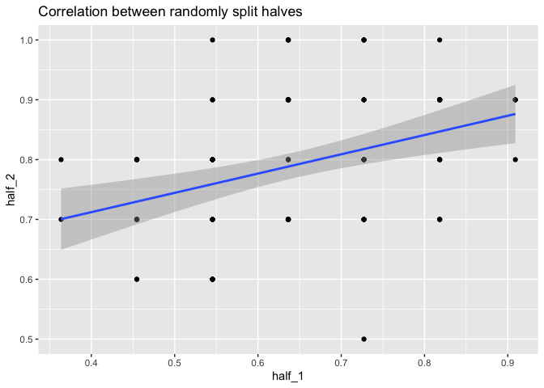

CART Analysis
================
Claire, Daniel, and Danielle’s group

## Reliability

Having determined to calculate Split-halves reliability, we will now
calculate the halves-based reliability and perform the Spearman Brown
correction:

``` r
#test without demo questions
set.seed(1213)
crat <- cart_bin |> 
  select(2:22) |> 
  mutate(id = 1:nrow(cart_bin)) |> 
  pivot_longer(cols = 1:21, names_to = "item", values_to = "response")

half_pick <- sample(1:21, 10)

half_2 <- filter(crat, item %in% names(table(crat$item))[half_pick]) |> 
  group_by(id) |> 
  summarize(half_2 = sum(response)/ 10)
half_1 <- filter(crat, ! item %in% names(table(crat$item))[half_pick])  |> 
  group_by(id) |> 
  summarize(half_1 = sum(response) / 11)

halves_scores <- inner_join(half_1, half_2, by = "id")

base_r <- cor(halves_scores$half_1, halves_scores$half_2)
adj_r <- (2 * base_r) / (1 + base_r)

pander::pander(round(adj_r, 4), caption = "Correlation Coefficient for Split halves reliability")
```

*0.5338*

Our correlation coefficient is not very high, but compared to some tests
in the social sciences, it’s actually pretty good.

We can also plot the scores between halves:

``` r
ggplot(halves_scores, aes(y = half_2, x = half_1)) + 
  geom_point() + 
  geom_smooth(formula = "y ~ x", method = "lm") +
  labs(title = "Correlation between randomly split halves")
```



We will additionally calculate Cronbach’s $\alpha$, having removed the
“Try scale” items (which will be addressed later) to ensure
unidimensionality(hopefully):

``` r
cron_bin <- cart_bin |> 
  select(-did_best, -group, -score, -einstein, -panda, -color_red, -computer_science)
psych::alpha(cron_bin)
```

    Some items ( NCMO farming population housing harvest_dummy ) were negatively correlated with the total scale and 
    probably should be reversed.  
    To do this, run the function again with the 'check.keys=TRUE' option


    Reliability analysis   
    Call: psych::alpha(x = cron_bin)

      raw_alpha std.alpha G6(smc) average_r  S/N   ase mean   sd median_r
          0.39      0.28    0.42     0.024 0.39 0.085 0.66 0.12    0.015

        95% confidence boundaries 
             lower alpha upper
    Feldt     0.19  0.39  0.55
    Duhachek  0.22  0.39  0.55

     Reliability if an item is dropped:
                  raw_alpha std.alpha G6(smc) average_r  S/N alpha se var.r  med.r
    hold_music         0.38      0.26    0.40    0.0231 0.35    0.085 0.018 0.0167
    stargazing         0.28      0.17    0.32    0.0132 0.20    0.100 0.017 0.0091
    Devo               0.37      0.25    0.39    0.0217 0.33    0.087 0.019 0.0134
    semesters          0.36      0.24    0.39    0.0207 0.32    0.088 0.018 0.0095
    NCMO               0.41      0.34    0.46    0.0338 0.52    0.082 0.018 0.0257
    farming            0.40      0.30    0.42    0.0273 0.42    0.083 0.018 0.0212
    mcmidnight         0.34      0.21    0.35    0.0175 0.27    0.091 0.017 0.0088
    population         0.42      0.32    0.44    0.0305 0.47    0.080 0.018 0.0246
    fhe                0.40      0.29    0.42    0.0265 0.41    0.083 0.018 0.0141
    snowballs          0.41      0.29    0.41    0.0264 0.41    0.081 0.018 0.0134
    housing            0.44      0.35    0.46    0.0340 0.53    0.076 0.018 0.0257
    grocery            0.37      0.26    0.40    0.0230 0.35    0.087 0.018 0.0167
    republican         0.40      0.32    0.44    0.0303 0.47    0.084 0.018 0.0212
    parks_dummy        0.24      0.14    0.28    0.0111 0.17    0.106 0.014 0.0134
    harvest_dummy      0.40      0.31    0.43    0.0289 0.45    0.083 0.017 0.0167
    mc_dummy           0.21      0.11    0.24    0.0083 0.13    0.111 0.013 0.0091

     Item statistics 
                    n  raw.r std.r   r.cor  r.drop mean   sd
    hold_music    100  0.321 0.301  0.1863  0.0903 0.39 0.49
    stargazing    100  0.555 0.523  0.5564  0.3548 0.44 0.50
    Devo          100  0.270 0.331  0.2238  0.1426 0.92 0.27
    semesters     100  0.361 0.355  0.2667  0.1525 0.72 0.45
    NCMO          100 -0.047 0.059 -0.2079 -0.1405 0.96 0.20
    farming       100  0.124 0.205  0.0497 -0.0211 0.90 0.30
    mcmidnight    100  0.422 0.427  0.4154  0.2165 0.70 0.46
    population    100  0.097 0.134 -0.0793 -0.0838 0.83 0.38
    fhe           100  0.198 0.223  0.0540  0.0093 0.81 0.39
    snowballs     100  0.251 0.225  0.0807  0.0131 0.42 0.50
    housing       100  0.122 0.055 -0.2070 -0.1124 0.62 0.49
    grocery       100  0.351 0.303  0.1888  0.1231 0.61 0.49
    republican    100  0.051 0.137 -0.0677 -0.0433 0.96 0.20
    parks_dummy   100  0.637 0.570  0.7085  0.4591 0.43 0.50
    harvest_dummy 100  0.145 0.169  0.0021 -0.0120 0.12 0.33
    mc_dummy      100  0.691 0.635  0.8271  0.5300 0.44 0.50

    Non missing response frequency for each item
                     0    1 miss
    hold_music    0.61 0.39    0
    stargazing    0.56 0.44    0
    Devo          0.08 0.92    0
    semesters     0.28 0.72    0
    NCMO          0.04 0.96    0
    farming       0.10 0.90    0
    mcmidnight    0.30 0.70    0
    population    0.17 0.83    0
    fhe           0.19 0.81    0
    snowballs     0.58 0.42    0
    housing       0.38 0.62    0
    grocery       0.39 0.61    0
    republican    0.04 0.96    0
    parks_dummy   0.57 0.43    0
    harvest_dummy 0.88 0.12    0
    mc_dummy      0.56 0.44    0

As we will see later, there are several items who correlate so poorly
that more of the BYU students than the Rexburgians answered correctly.
The Alpha calculation indicates several items we might remove. If we
take out the ones that it indicates, we are left with the following,
drastically shorter test:

``` r
cron_bin2 <- cron_bin |> 
  select(-housing, -owned_by, -population, -snowballs, -harvest_dummy, -NCMO, -farming, -hold_music)
psych::alpha(cron_bin2)
```


    Reliability analysis   
    Call: psych::alpha(x = cron_bin2)

      raw_alpha std.alpha G6(smc) average_r S/N   ase mean   sd median_r
          0.59      0.55    0.58      0.12 1.2 0.058 0.67 0.21      0.1

        95% confidence boundaries 
             lower alpha upper
    Feldt     0.46  0.59   0.7
    Duhachek  0.48  0.59   0.7

     Reliability if an item is dropped:
                raw_alpha std.alpha G6(smc) average_r  S/N alpha se var.r med.r
    stargazing       0.55      0.50    0.53     0.111 1.00    0.064 0.020 0.100
    Devo             0.58      0.54    0.57     0.128 1.17    0.059 0.024 0.100
    semesters        0.58      0.54    0.57     0.128 1.17    0.058 0.023 0.100
    mcmidnight       0.56      0.51    0.54     0.114 1.03    0.061 0.023 0.095
    fhe              0.60      0.55    0.58     0.135 1.25    0.056 0.023 0.135
    grocery          0.58      0.52    0.55     0.120 1.09    0.058 0.024 0.100
    republican       0.60      0.59    0.61     0.151 1.43    0.057 0.019 0.143
    parks_dummy      0.47      0.43    0.45     0.087 0.76    0.076 0.013 0.049
    mc_dummy         0.46      0.43    0.44     0.086 0.76    0.078 0.010 0.064

     Item statistics 
                  n raw.r std.r r.cor r.drop mean   sd
    stargazing  100  0.55  0.51 0.421 0.3191 0.44 0.50
    Devo        100  0.32  0.40 0.235 0.1825 0.92 0.27
    semesters   100  0.42  0.40 0.233 0.1896 0.72 0.45
    mcmidnight  100  0.49  0.49 0.371 0.2706 0.70 0.46
    fhe         100  0.32  0.35 0.168 0.1175 0.81 0.39
    grocery     100  0.46  0.45 0.314 0.2227 0.61 0.49
    republican  100  0.11  0.24 0.015 0.0077 0.96 0.20
    parks_dummy 100  0.71  0.67 0.699 0.5372 0.43 0.50
    mc_dummy    100  0.73  0.67 0.722 0.5642 0.44 0.50

    Non missing response frequency for each item
                   0    1 miss
    stargazing  0.56 0.44    0
    Devo        0.08 0.92    0
    semesters   0.28 0.72    0
    mcmidnight  0.30 0.70    0
    fhe         0.19 0.81    0
    grocery     0.39 0.61    0
    republican  0.04 0.96    0
    parks_dummy 0.57 0.43    0
    mc_dummy    0.56 0.44    0

as we can see, the $\alpha$ and $\lambda$ coefficients are much higher,
despite a shorter test.

### “Didn’t try/pay attention” Scale

Using the predetermined items, we can calculate a Try Scale score for
each respondent. As seen below, there are 2 individuals who scored a 2
on the Try Scale.

``` r
cart_long <- cart_bin |> 
  mutate(id = 1:nrow(cart_bin)) |> 
  pivot_longer(cols = 2:23, names_to = "item", values_to = "response")

try_scale <- cart_long |> 
  group_by(id) |> 
  filter(item %in% c("einstein", "panda", "color_red", "computer_science")) |> 
  summarize(tried = sum(response))
pander(table(try_scale$tried))
```

|  2  |  3  |  4  |
|:---:|:---:|:---:|
|  2  | 23  | 75  |

``` r
cart_long <- cart_long |> 
  filter(id != c(28,40))

t_sd <- sd(try_scale$tried)
t_mu <- 4
t_xb <- 2
t_n <- length(try_scale$tried)

t_score <- (t_xb - t_mu) / (t_sd / sqrt(t_n))
```

It is very unlikely that an individual would score a 2 if they were in
fact trying their best. Assuming that an individual trying their best
would get a 4, we can do a t-test, which results in a t-score of
approximately -40 and thus a p-value very near 0. Therefore, we will
remove those individuals whose Try_Scale score is a 2.

## Validity

We will attempt to demonstrate group differentiation. First, we format
the data to distinguish between those in our “Rexburg Resident” group
and those in Utah vs. elsewhere. Then, we will calculate scores for each
student and perform an ANOVA to determine whether mean scores differ
across groups.

``` r
group_val <- cart_long |> 
  group_by(id) |> 
  summarize(score = sum(response),
            group = as.factor(group)) |> 
  distinct()

group_nov <- aov(score ~ group, data = group_val)

pander(summary(group_nov))
```

|               | Df  | Sum Sq | Mean Sq | F value |  Pr(\>F)  |
|:-------------:|:---:|:------:|:-------:|:-------:|:---------:|
|   **group**   |  2  | 236.9  |  118.4  |  29.77  | 8.284e-11 |
| **Residuals** | 97  | 385.9  |  3.978  |   NA    |    NA     |

Analysis of Variance Model

``` r
tukeyout <- TukeyHSD(group_nov, "group")

#pairwise.t.test(group_val$score, group_val$group, adjust = "bonferroni")
```

As we can see, there is a significant effect in group. To identify which
groups are different from each other, we will consult a Tukey’s Honest
Significant Difference adjusted pairwise t-test. The results are
summarized in a plot below, where a line intersecting the dotted line at
0 is nonsignificant and a line that doesn’t touch 0 is significant. It
is most important that the 0-1 group is significant, so that’s the line
we are looking at:

``` r
plot(tukeyout)
```


As we can see, there is a significant difference in mean scores between
the Rexburg Resident group and the Utah resident group. This indicates
that our test is successful in identifying those who are/are not
Rexburgians.

Additionally, we can visualize a density plot/histogram of the CART
scores according to the respondent group.

``` r
ggplot(group_val, aes(x = score)) + 
  geom_histogram(aes(y = ..density..), fill = "white", color = "black", binwidth = 2) +
  #geom_dotplot(aes(y = ..density..)) +
  geom_density(color = "olivedrab", linetype = "3121", size = 1.5 ) +
  #stat_function(fun = function(x) mean(x), geom = "line", color = "firebrick") +
  facet_wrap(facets = vars(group)) +
  labs(title = "Distribution of CART scores by respondent group",
       y = "",
       x = "Score")
```


### Item difficulty analysis

Having reformatted each item, we can find combined difficulties across
the test as well as difficulty between groups. Doing so will help us
determine which, if any, questions should be re-worked or removed
entirely.

``` r
item_difficulty <- cart_long |> 
  filter(! item %in% c("group", "did_best")) |> 
  group_by(item) |> 
  summarize(difficulty = sum(response) / n()) |> 
  arrange(difficulty)

difficulty_by_group <- cart_long |> 
  filter( item != "did_best") |> 
  group_by(item, group) |> 
  summarize(difficulty = sum(response) / n()) |> 
  pivot_wider(names_from = group, values_from = difficulty, names_prefix = "group_") |> 
  arrange(group_0)

difficulty_all <- inner_join(item_difficulty, difficulty_by_group, by = "item") |> 
  mutate(GoodQ = if_else(group_0 > difficulty , if_else(difficulty > group_1 & difficulty > group_2, "Yes", "Maybe"), "Delete")) |> 
  arrange(GoodQ)
names(difficulty_all) <- c("item", "difficulty", "Rexburg", "Utah", "Other", "Good Question") 


pander::pander(difficulty_all)
```

|       item       | difficulty | Rexburg |  Utah   | Other  | Good Question |
|:----------------:|:----------:|:-------:|:-------:|:------:|:-------------:|
|  harvest_dummy   |   0.1212   | 0.1071  | 0.1667  |   0    |    Delete     |
|    snowballs     |   0.4242   | 0.4107  | 0.4722  | 0.2857 |    Delete     |
|     housing      |   0.6162   | 0.5357  | 0.6944  | 0.8571 |    Delete     |
| computer_science |   0.8586   | 0.8393  | 0.8889  | 0.8571 |    Delete     |
|     farming      |   0.9091   | 0.8929  | 0.9444  | 0.8571 |    Delete     |
|       NCMO       |   0.9596   | 0.9464  | 0.9722  |   1    |    Delete     |
|    color_red     |     1      |    1    |    1    |   1    |    Delete     |
|     einstein     |     1      |    1    |    1    |   1    |    Delete     |
|     owned_by     |     1      |    1    |    1    |   1    |    Delete     |
|    mcmidnight    |   0.697    | 0.8393  | 0.4722  | 0.7143 |     Maybe     |
|       fhe        |   0.8182   | 0.8571  |  0.75   | 0.8571 |     Maybe     |
|    population    |   0.8384   | 0.8393  | 0.8056  |   1    |     Maybe     |
|      panda       |   0.899    | 0.9107  | 0.8611  |   1    |     Maybe     |
|       Devo       |   0.9192   | 0.9464  | 0.8611  |   1    |     Maybe     |
|    republican    |   0.9596   | 0.9643  | 0.9444  |   1    |     Maybe     |
|    hold_music    |   0.3838   | 0.4464  | 0.3056  | 0.2857 |      Yes      |
|   parks_dummy    |   0.4242   | 0.6786  | 0.05556 | 0.2857 |      Yes      |
|    stargazing    |   0.4343   |  0.625  | 0.1389  | 0.4286 |      Yes      |
|     mc_dummy     |   0.4444   |  0.75   |    0    | 0.2857 |      Yes      |
|     grocery      |   0.6061   | 0.7143  | 0.4722  | 0.4286 |      Yes      |
|    semesters     |   0.7172   | 0.8214  | 0.5556  | 0.7143 |      Yes      |

As we can see, there are 6 items which are indicated as being
“high-quality” (whatever that means in this context), 6 with
questionable discrimination/usefulness, and 9 items where the Rexburg
group either did worse or no better than the Utah/Other groups.
