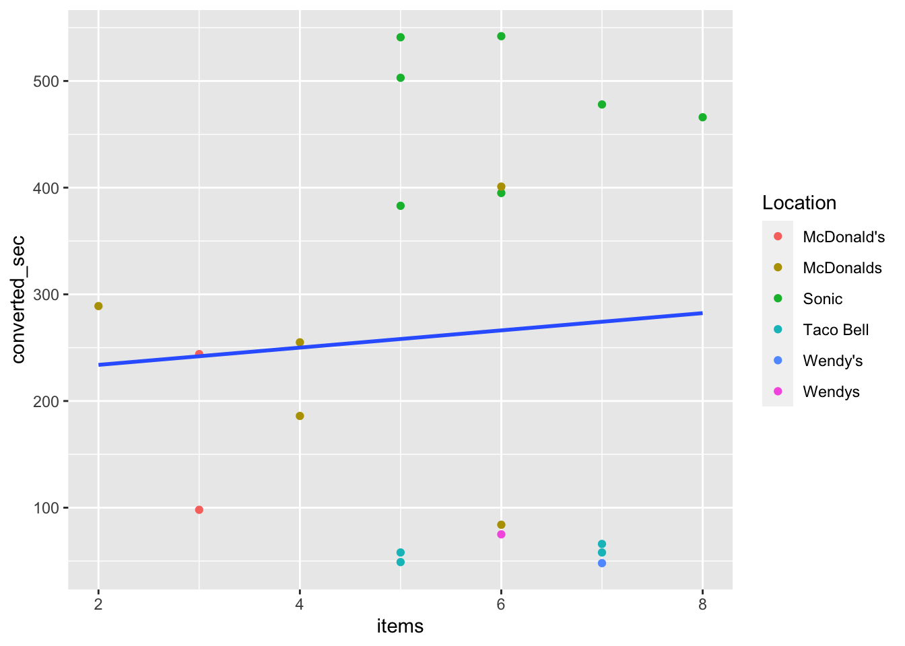

```r
pacman::p_load(mosaic, tidyverse)
rxbrg <- read_csv("data/data6_28.csv")
fast_ova <- aov(converted_sec ~ Location, data = rxbrg)
fast_ova <- aov(converted_sec ~ Location + items, data = rxbrg)
```


```r
ggplot(rxbrg, aes(y = converted_sec, x = items)) + geom_point(aes(color = Location)) + geom_smooth(method = "lm", se = FALSE)
```

<!-- -->


