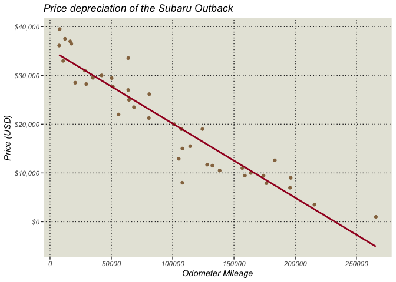
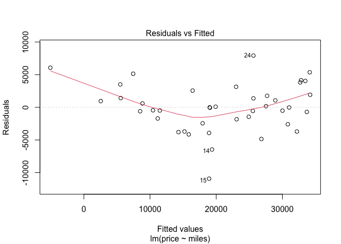
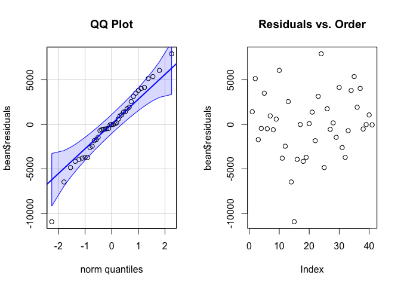
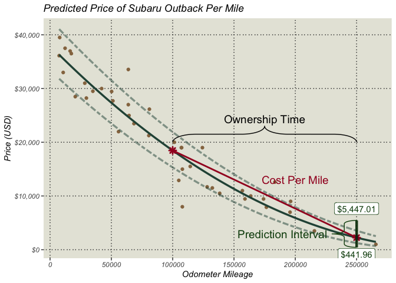

How much is that Subaru Outback?
================
Daniel Bagley

``` r
pacman::p_load(car, tidyverse, latex2exp)


winto_green <- rgb(16, 32, 27, maxColorValue = 100)
beege <- rgb(59, 46, 31, maxColorValue = 100)
reg_red <- rgb(64, 5, 15, maxColorValue = 100)
timber_green <- rgb(5, 29, 5, maxColorValue = 100)
winter <- rgb(90, 90, 86, maxColorValue = 100)
granite <- rgb(16, 16, 17, maxColorValue = 100)

outback <- read_csv("../../data/outback.csv")

bean <- lm(price ~ miles, data = outback)
back_sqrt <- lm(sqrt(price) ~ miles, data = outback)
b <- coef(back_sqrt)

base_plot <- ggplot(outback, aes(y = price, x = miles)) + 
  geom_point(color = beege) +
  theme(panel.background = element_rect(fill = winter),
        panel.grid = element_line(color = granite, linetype = "1213"),
        panel.grid.minor = element_blank(),
        text = element_text(face = "italic"),
        legend.position = "bottom") +
  scale_y_continuous(labels = scales::dollar_format()) +
  scale_x_continuous(breaks = c(0, 50000, 100000, 150000, 200000, 250000)) 
```

<div class="panel-tabset">

# Collapse

Press **View Analysis** to see where these conclusions came from.

# View Analysis

## Backgroud

Currently, I own one car and my wife owns one car. The first is a truck,
and the second is a small hatchback. We would like to own only one car,
but don’t want to lose the usefulness of the truck or the fuel
efficiency of the hatchback. One solution to this may be picking a new
vehicle that sort of plays both sides; an SUV crossover. What better
example of the Crossover than Subaru’s
[Outback](https://en.wikipedia.org/wiki/Subaru_Outback), a vehicle
famous for its rugged dependability and long life? This analysis, then,
will seek to determine at which price-point and mileage we should
purchase our own Subaru Outback to get the best vehicle value. To do
this, we will investigate whether there is a significant relationship
between Price and Mileage for randomly-selected Subaru Outbacks, and
then use that model to predict vehicle price depreciation over time of
our own future Outback.

### Model and Hypotheses

For this analysis, we will create a linear model of the relationship
between Price and mileage for the Subaru Outback

$$
  \underbrace{Y_i}_\text{Price} = \overbrace{\beta_0}^\text{y-int} + \overbrace{\beta_1}^\text{slope} \underbrace{X_i}_\text{Mileage} + \epsilon_i \quad \text{where} \ \epsilon_i \sim N(0, \sigma^2)
$$

In this case, it is meaningful to consider both the slope (relationship
between price and mileage) and the y-intercept (price at zero miles) of
our regression model, so we will test both:

#### Y-Intercept

The hypotheses for y-intercept are given by

$$
H_0: \beta_0 = 0
$$ $$
H_a: \mu_{\text{athletic}} =\mu_{\text{non-athletic}}
$$ Where $\beta_0$ is the y-intercept of the regression line. If the
y-intercept is not zero, we can determine what a vehicle with close to 0
miles on its odometer will cost.

#### Slope

The hypotheses for our slope are given by

$$
H_0: \beta_1 = 0
$$

$$
H_a: \beta_1 \neq 0
$$

where $\beta_1$ is the slope of the regression line. If it is not zero,
there will be a significant relationship between Price and odometer
mileage. In other words, we will be able to predict the change in
average price of a Subaru Outback per mile it is driven.

### Data collection procedure

To prevent potentially recording the same vehicle twice (due to it being
listed multiple places), the data for this analysis was all collected
from [CarFax](carfax.com), a used car sales website which appears to
give complete information on price, mileage, and year of vehicle
construction. To compare the same vehicle across the board, I limited
results only to the *Subaru Outback 2.5I Premium*, using the following
search: [Subaru Outback
Listings](https://www.carfax.com/Used-Subaru-Outback_w620)

This search yielded approximately 8400 vehicle listings. However, the
CarFax website will only load 25 vehicles per page and up to 50 pages
per search, limiting my available choices to approximately 1250 cars.
Examining the distribution of vehicles, it was obvious that there is a
strong right-skew. There are almost 8,000 vehicles under 150,000 miles
for sale, with only about 500 over 150,000 miles. Therefore, to select a
(hopefully) representative sample of all available Subaru Outbacks, I
performed 4 searches, pulling 10 vehicle listings from each. The
searches were of cars from 0-50,000 miles, 50,001-100,000 miles,
100,001-150,000 miles, and 150,001+ miles, to give a total of 40 vehicle
listings in a database listing their sale price, model year, and current
Odometer (mileage) reading.

In this analysis, we ignored model year as a factor because it appeared
linearly co-dependent upon mileage as a predictor of price. Instead, we
focused only on price and mileage.

## Data Analysis

Having collected the data, it is now time to test our hypotheses. We
will begin by visualizing:

``` r
base_plot +
  geom_smooth(method = "lm", se = FALSE, 
              formula = "y ~ x", color = reg_red) +
  labs(title = "Price depreciation of the Subaru Outback",
       x = "Odometer Mileage",
       y = "Price (USD)")
```



Notice that the red regression line appears to fit well for most of the
data. Because of this, there is a good likelihood that this regression
will be a good predictive model for Subaru Outbacks in general.

### Hypothesis test results

Let us examine the results of the test:

``` r
pander::pander(summary(bean), caption = "")
```

|                 | Estimate | Std. Error | t value | Pr(\>\|t\|) |
|:---------------:|:--------:|:----------:|:-------:|:-----------:|
| **(Intercept)** |  35324   |    1025    |  34.45  |   8.2e-31   |
|    **miles**    |  -0.152  |  0.008782  | -17.31  |  6.687e-20  |

| Observations | Residual Std. Error | $R^2$  | Adjusted $R^2$ |
|:------------:|:-------------------:|:------:|:--------------:|
|      41      |        3676         | 0.8848 |     0.8819     |

With $R^2 = 0.885$ and significant p-values for both slope and
intercept, it seems as though this model is an accurate predictor of
Outback Price!

### Diagnostic plots

However, before moving forwards and acting based on these results, it is
critical to know whether the data collected is appropriate for linear
regression. To determine this, we will examine several plots which
demonstrate if the requirements for regression have been met.

we find $p = 0.1456$. With $\alpha = 0.05$, we fail to reject the null
hypothesis.

First, we check a diagnostic plot of Residuals vs. Fitted values. This
will allow us to determine if the two requirements of equal variance and
linearity are met. If we see a pattern in the plot, there may be cause
to question those requirements. Second, a Normal QQ plot. This plot lets
us evaluate whether the data are normally distributed. If the points
follow the line without too much deviation, our requirements are met.
Lastly, we will examine a plot of the Residuals according to their
order. If there is no obvious pattern, we can assume that the
requirement of independence is met.

``` r
#|label: diagnostic_plots
#|message: false
#|warning: false


plot(bean, which = 1)
```



``` r
par(mfrow = c(1,2))
qqPlot(bean$residuals, id = FALSE, main = "QQ Plot")
plot(bean$residuals, main = "Residuals vs. Order")
```



``` r
par(mfrow = c(1,1))
```

Examining these diagnostic plots leads to several interesting results.
First, the QQ plot and Residuals vs. order plots appear normal, with
little deviation from the line in the QQ plot and no obvious pattern in
the Residuals vs. Order plot. There is, however, one outlier, identified
as the 15th item in the data set, which appears to have a much lower
price than expected.

Unlike the QQ plot, however, there are some problems with the Residuals
vs. fitted plot. As seen by the red line and the general trend of the
points, there is a clear curve which indicates our assumption of
linearity is not met. Because of this, the data is inappropriate for
regression.

### Data Transformation

However, there is a potential solution! If we use a transformation upon
our data, it may become linear and therefore meet the regression
requirements.

To determine which transformation we should perform, we will examine a
Box-Cox plot of log-likelihood. The x-axis of the plot shows the power
to which we can raise our response variable for the best possible
result:

``` r
boxCox(bean, xlim = c(-1, 1.5))
```


As the plot reveals, a transformation to the 1/2 power, also known as a
square root, will be most effective in addressing the non-linearity of
the data. Performing that transformation, we will examine diagnostic
plots anew:

``` r
plot(back_sqrt, which = 1)
```


``` r
par(mfrow = c(1,2))
qqPlot(back_sqrt$residuals, id = FALSE, main = "QQ Plot")
plot(back_sqrt$residuals, main = "Residuals vs. Order")
```


``` r
par(mfrow = c(1,1))
```

The Residuals vs. Fitted plot looks much better and the data now appears
linear. The QQ Plot appears to still indicate normality, and the
Residuals vs. Order plot has no obvious pattern, though the outlier
appears to have become more extreme.

### Model in Prime Space

With more appropriate diagnostic plots, we can proceed with an analysis
of the transformed data. Performing the linear regression, we find the
following results:

``` r
summary(back_sqrt) |> pander::pander(caption = "Transformed model")
```

|                 |  Estimate  | Std. Error | t value | Pr(\>\|t\|) |
|:---------------:|:----------:|:----------:|:-------:|:-----------:|
| **(Intercept)** |   194.9    |   3.382    |  57.62  |  2.344e-39  |
|    **miles**    | -0.0005898 | 2.896e-05  | -20.37  |  2.186e-22  |

| Observations | Residual Std. Error | $R^2$  | Adjusted $R^2$ |
|:------------:|:-------------------:|:------:|:--------------:|
|      41      |        12.12        | 0.9141 |     0.9119     |

Transformed model

In our transformed space, we find a model where

$$
 \hat{Y'}_i = 194.8 - 0.0005902 X_i
$$ We can then replace $\hat{Y'}_i$ with $\sqrt{\hat{Y}_i}$ and find

$$
 \sqrt{\hat{Y}_i} = 194.8 - 0.0005902 X_i
$$ which we solve for $\hat{Y}_i$ thusly, returning the model to our
original space of interpretation:

$$
  \hat{Y}_i = (194.8 - 0.0005902 X_i)^2
$$

This is powerful because we have now fixed the problems with linearity,
fitted a better model, and returned that model to an interpretable
space. Note that our $R^2$ is now 0.914 with a Residual Standard Error
of 12.12. This RSE is quite good, and the p-values are essentially zero.
How does this model compare to the original one?

### Comparing the two models

Visualizing this model compared to the original, we see that the new
line has a slight curve (due to now being quadratic) which appears to
fit the data better than the straight line, as we expected from the
Residuals vs. Fitted plot.

``` r
base_plot +
  labs(title = TeX(input = "Comparison of $\\beta_1$ across models"), 
       x = "Odometer Mileage",
       y = "Price (USD") +
    geom_smooth(aes(color = "untransformed model"),
              se = FALSE, method = "lm", formula = "y ~ x", alpha = 0.2) +
  stat_function(aes(color = "transformed model"),
                fun = function(x) (b[1] + b[2] * x)^2, size = 1.2) +
  scale_color_manual("Model",values = c(winto_green, reg_red))
```


While the red line fits well for much of the data, it is obvious near
the edges that the red line does not account for the changing rate of
price depreciation for vehicles with very high or very low mileage.
Because of this, the square-root transformed model is a better fit,
although it is harder to interpret directly. We therefore use the
transformed model to fit the requested plot.

### Constructing a prediction

It seems logical to purchase the vehicle when it will depreciate in
price as little as possible. However, waiting too long will result in
purchasing an Outback with too many miles and little time. To find a
happy medium, we will purchase the vehicle at around 100,000 miles, as
it seems most Outbacks last far beyond that but are not as expensive at
that mileage. Because both I and my wife like to get as much value as
possible from a vehicle, it is likely we will drive a car until it stops
working, or at least is near unto that state. Since there are many
Outbacks above 200,000 miles but not many past 250,000 miles, that seems
like a good estimate of when we will sell/junk the car. We can visualize
this interval:

</div>

``` r
pred_dat <- data.frame(price = predict(back_sqrt, 
                                       newdata = data.frame(miles = c(100000, 250000)))^2,
                       miles = c(100000, 250000))

pred_int <- predict(back_sqrt,newdata = data.frame(miles = 250000), 
        interval = "prediction")^2

f_plot <- base_plot +
  stat_function(aes(color = "transformed model"),
                fun = function(x) (b[1] + b[2] * x)^2, 
                size = 1.2, color = winto_green) +
    stat_function(aes(color = "transformed model"),
                fun = function(x) (b[1] + 12.12 + b[2] * x)^2, 
                size = 1.2, color = winto_green, alpha = 0.5, linetype = "3121") +
    stat_function(aes(color = "transformed model"),
                fun = function(x) (b[1] - 12.12 + b[2] * x)^2, 
                size = 1.2, color = winto_green, alpha = 0.5, linetype = "3121") +
  geom_point(data = pred_dat, color = reg_red, size = 2, shape = 8, stroke = 1.5) +
  geom_smooth(data = pred_dat, se = FALSE, method = "lm", 
              color = reg_red, formula = "y~x") +
  ggbrace::geom_brace(aes(x = c(100000, 250000),
                          y = c(20000, 23000),
                          label = "Ownership Time"),
                      inherit.aes = F, inherit.data = F,
                      labelsize = 5) +
  annotate(geom = "text", x = 200000, y = 13000,
           label = "Cost Per Mile", 
           color = reg_red, size = 5) +
  labs(title = "Predicted Price of Subaru Outback Per Mile",
       x = "Odometer Mileage",
       y = "Price (USD)") +
   geom_segment(aes(x = 250000, xend = 250000, 
                  y = pred_int[2], yend = pred_int[3]), 
               color = timber_green, size = 1.5, alpha = 0.06) +
  annotate("label", label = str_c("$",round(pred_int[2],2)), 
           y = pred_int[2], x = 250000, vjust = 1.1, color = timber_green) +
   annotate("label", label = "$5,447.01", 
            y = pred_int[3], x = 250000, vjust = -0.5, color = timber_green) +
  ggbrace::geom_brace(aes(x = c(230000, 249900), y = c(pred_int[2], pred_int[3]), 
                 label = "Prediction Interval"),
             inherit.aes = FALSE, inherit.data = FALSE,
             rot = 270, labelsize = 5, color = timber_green)
  

f_plot
```



Over this period, we find that the Purchase Cost per mile is

$$
  \frac{18,424.09}{150,000} = 0.1228
$$ meaning that the vehicle will cost approximately 12.3 cents per mile
over that period.

Obviously the cost per mile decreases as the mileage of the vehicle
increases. It would therefore be advantageous to purchase the vehicle
and then keep it as long as possible, but also to purchase it for as
little as possible, which only occurs as the mileage increases.
