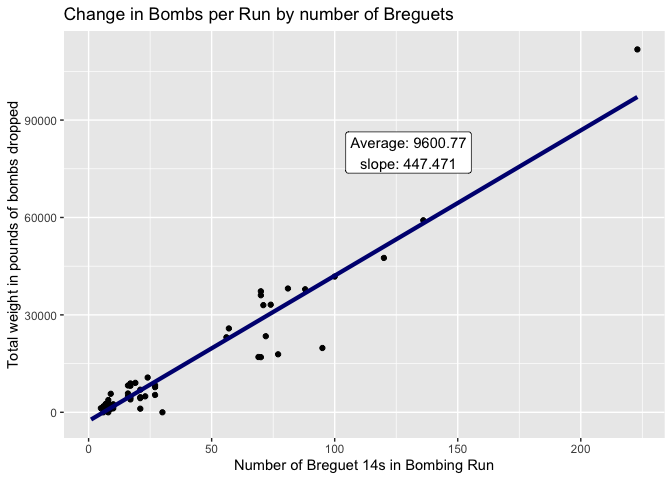

Bombs from Biplanes
================
Daniel Bagley

``` r
pacman::p_load(mosaic, lubridate, tidyverse)

date_clean <- function(date) { #janky function to parse posixct dates from the data
  day <- str_sub(date, end = 2)
  month <- str_sub(date, start = 3, end = 5)
  year <- str_sub(date, start = -4)
  monat <-case_when(month == "Jan" ~ "01",
                    month == "Feb" ~ "02",
                    month == "Mar" ~ "03",
                    month == "Apr" ~ "04",
                    month == "May" ~ "05",
                    month == "Jun" ~ "06",
                    month == "Jul" ~ "07",
                    month == "Aug" ~ "08",
                    month == "Sep" ~ "09",
                    month == "Oct" ~ "10",
                    month == "Nov" ~ "11",
                    month == "Dec" ~ "12")
  moment <- str_c(day, monat, year)
  parse_date(moment, format = "%d%m%Y" )
  }

all_bombs <- read_csv("data/western_front_bombing.csv") |> 
  #add index column for editing
  mutate(index = 1:length(Date)) |> 
  filter(!(index %in% c(12, 2644, 6064, 7055)))  |> #Rows with errors identified by read_csv
#Edit Variable Names
  #remove non-syntactically sound characters
  rename_with( ~ str_replace_all(.x, "(-\\s)|((?<!L)-)|\\(|\\)|\\?", "")) |> 
  rename_with( ~ str_replace_all(.x, "\\#", "num")) |> 
  #send all names to snake case
  rename_with( ~ tolower(gsub(" ", "_", .x, fixed = TRUE))) |> 
  #cover all the names that were uniquely bad
  rename( raid_or_alert = `raid=1,_alert=0`, summary_or_comments = `summary_rec_t/f_or_comments`,
         ships_launched = `a/c_launched`, forced_landing_no_damage = `fl-no_damage`, 
         forced_landing_damage = `fl-damage`, ship_type = `a/c_type`, 
         source = `page_num,_maurer_maurer,_v.iv,_or_other_reference`) |> 
#Fix the Dates
  mutate(
    #Replace the 2 digit year code with a 4 digit year code and show off that I know what a regex is
    date_new = str_replace(date, "(?<=\\w{3})\\d{2}", function(x) str_c("19", x)),
    #use my clunky function to get POSIXCT dates
    date = date_clean(date_new)) |> 
  separate(date_new, into = c("day", "month", "year"), sep = c(2, 5)) |> 
# mutate some columns with interesting features
  mutate(tgt_type_exp = case_when(
    target_type == "A" ~ "Airfield",
    target_type == "B" ~ "Blast Furnace",
    target_type == "C" ~ "Chemical",
    target_type == "I" ~ "Industry",
    target_type == "M" ~ "Munitions Factory",
    target_type == "R" ~ "Rail Target",
    target_type == "T" ~ "Tactical",
    target_type == "O" ~ "Other/Multiple",
    target_type == "P" ~ "Reprisals"),
    bombs_per_ship = bomb_wgt_lb / ships_launched
    )


  #we only want non-summary reports of allied squadrons
bombs <- filter(all_bombs, !is.na(sqn), !(summary_or_comments == "TRUE")) 
# Sum NAs in each column
NAS <- map_dbl(bombs, function(x) sum(is.na(x))) 
# Don't need the last 10 columns in this 49 column dataset
keeps <- names(sort(NAS)[1:(ncol(bombs) - 10)])
bombs <- bombs |> 
  select(all_of(keeps))
```

``` r
bombs |> 
  filter(!is.na(tgt_type_exp), !target_type == "P" ) |> 
ggplot(aes(y = bomb_wgt_lb, x = date, color = tgt_type_exp)) +
  geom_point() +
  facet_wrap(facets = vars(tgt_type_exp), scales = "free_y") +
  theme(legend.position = "none",
        axis.text.x = element_text(angle = 70, vjust = 0.6, hjust = 0.5))
```

    Warning: Removed 331 rows containing missing values (geom_point).


``` r
ggplot(bombs, aes(y = bomb_wgt_lb, fill = ship_type)) +
  geom_boxplot()
```

    Warning: Removed 610 rows containing non-finite values (stat_boxplot).


``` r
ggplot(bombs, aes(y = bombs_per_ship, fill = ship_type)) + 
  geom_boxplot()
```

    Warning: Removed 1835 rows containing non-finite values (stat_boxplot).


``` r
breguet_arm <- bombs |> 
  filter(ship_type == "Breguet14")
breg_ord_lm <- lm(bomb_wgt_lb ~ ships_launched, data = breguet_arm)
pander::pander(summary(breg_ord_lm))
```

|                    | Estimate | Std. Error | t value | Pr(\>\|t\|) |
|:------------------:|:--------:|:----------:|:-------:|:-----------:|
|  **(Intercept)**   |  -2671   |   801.5    | -3.332  |  0.001434   |
| **ships_launched** |  447.5   |   15.63    |  28.64  |  3.328e-38  |

| Observations | Residual Std. Error | $R^2$  | Adjusted $R^2$ |
|:------------:|:-------------------:|:------:|:--------------:|
|      66      |        5028         | 0.9276 |     0.9265     |

Fitting linear model: bomb_wgt_lb \~ ships_launched

``` r
b <- coef(breg_ord_lm)
ggplot(breguet_arm, aes(y = bomb_wgt_lb, x = ships_launched)) + 
  geom_point() +
  stat_function(fun = function(x) b[1] + (b[2] * x), size = 1.5, color = "navy") +
  annotate("label", x = 130, y = 80000, label = str_c("Average: ", as.character(round(mean(breguet_arm$bomb_wgt_lb, na.rm = TRUE), 2)), "\nslope: ", as.character(round(b[2],3)))) +
  labs(title = "Change in Bombs per Run by number of Breguets",
       x = "Number of Breguet 14s in Bombing Run",
       y = "Total weight in pounds of bombs dropped")
```

    Warning: Removed 149 rows containing missing values (geom_point).



``` r
big_bombs <- bombs |> 
  arrange(-bomb_wgt_lb) |> 
  head(50)
```
